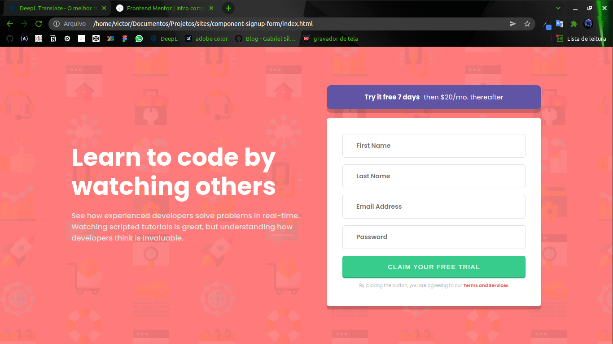

# Frontend Mentor - Intro component with sign up form solution

This is a solution to the [Intro component with sign up form challenge on Frontend Mentor](https://www.frontendmentor.io/challenges/intro-component-with-signup-form-5cf91bd49edda32581d28fd1). Frontend Mentor challenges help you improve your coding skills by building realistic projects. 

## Table of contents

- [Overview](#overview)
  - [Screenshot](#screenshot)
  - [Links](#links)
- [My process](#my-process)
  - [Built with](#built-with)
  - [Useful resources](#useful-resources)
- [Author](#author)

## Overview

### Screenshot

### Links

- Solution URL: [Click here](https://www.frontendmentor.io/solutions/intro-component-with-sign-up-form-css3-html5-javascript-WIMz8n2am)
- Live Site URL: [Click here](https://victor-eduardo-art.github.io/component-signup-form/)

## My process

### Built with

- HTML5
- CSS3
- JavaScript
- Flexbox

## Author

- Github - [@Victor-Eduardo-art](https://github.com/Victor-Eduardo-art)
- Frontend Mentor - [@Victor-Eduardo-art](https://www.frontendmentor.io/profile/Victor-Eduardo-art)